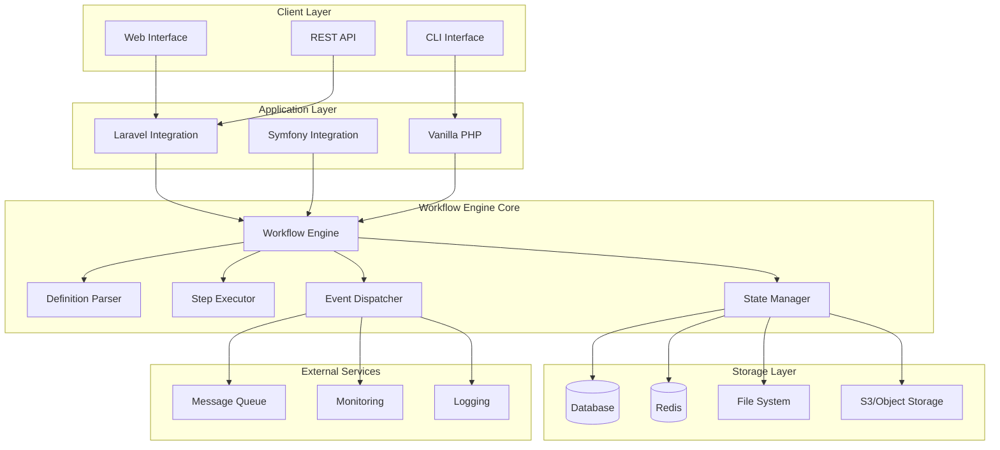
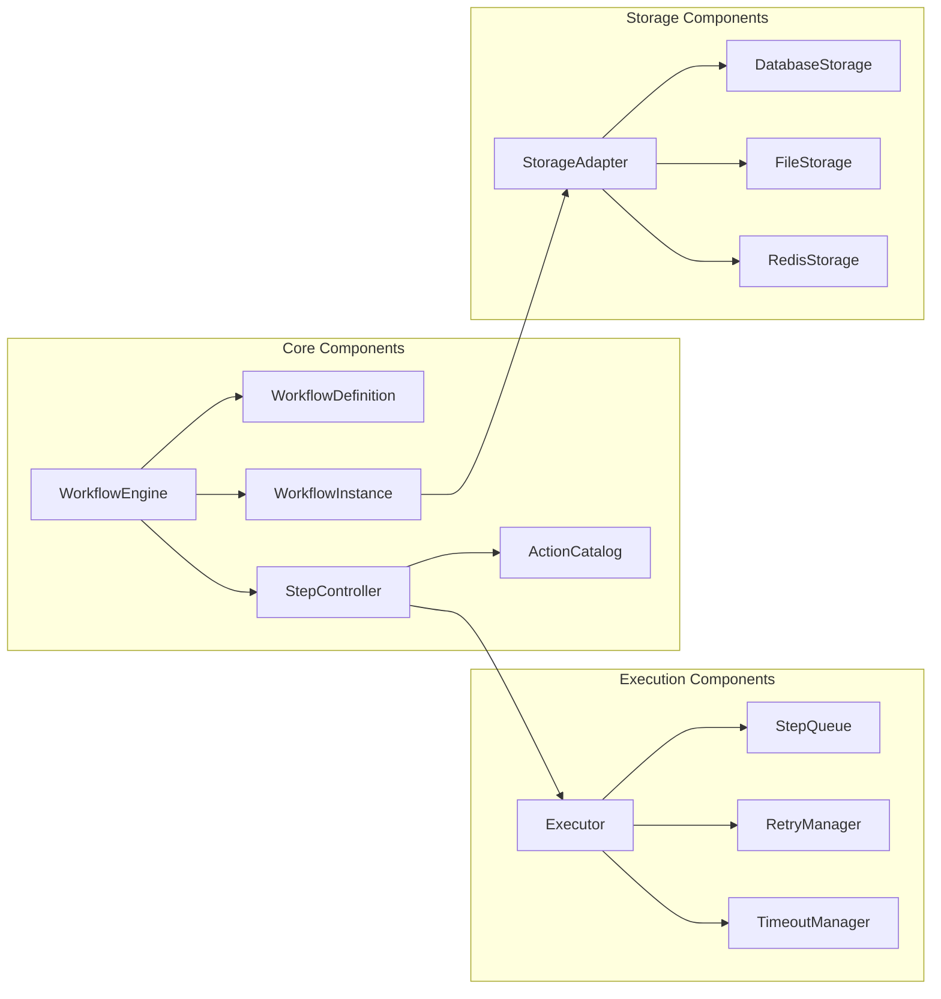
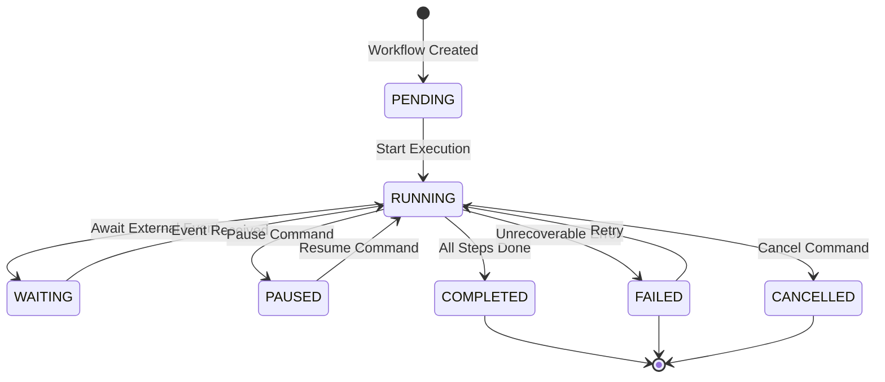
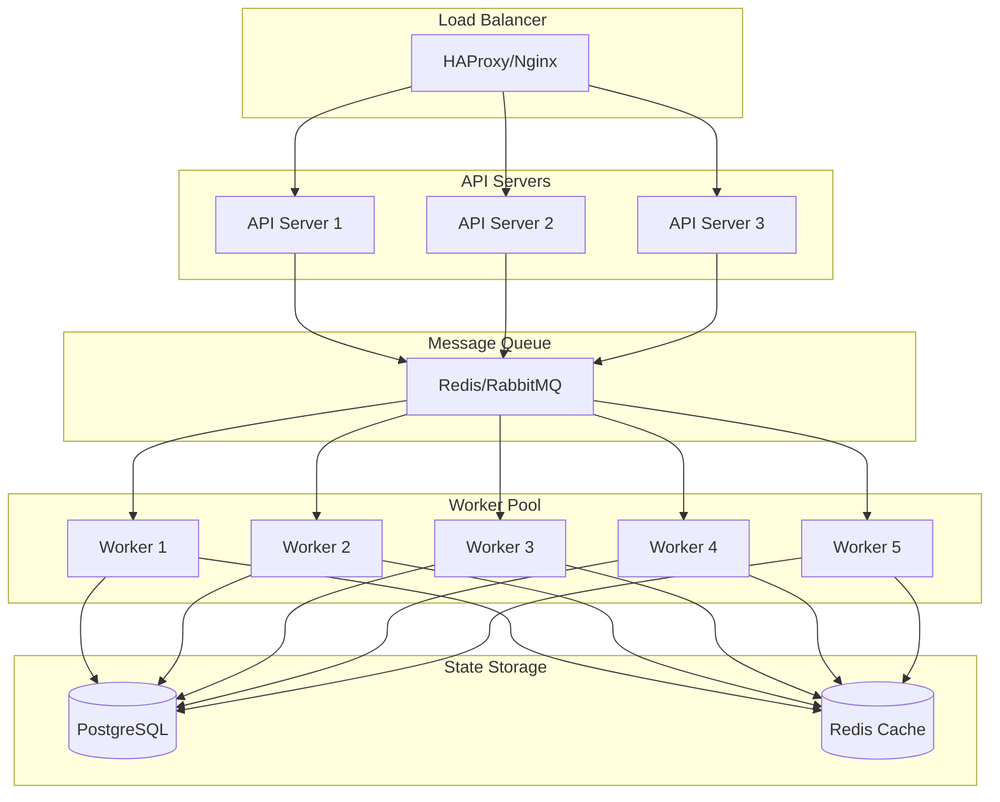

# Technical Documentation: Workflow Mastery Implementation Guide

## Table of Contents
1. [Executive Summary](#executive-summary)
2. [Architecture Overview](#architecture-overview)
3. [Core Components](#core-components)
4. [Implementation Details](#implementation-details)
5. [Integration Strategies](#integration-strategies)
6. [Deployment Architecture](#deployment-architecture)
7. [Real-World Implementation Examples](#real-world-implementation-examples)
8. [Performance Optimization](#performance-optimization)
9. [Security Considerations](#security-considerations)
10. [Monitoring and Observability](#monitoring-and-observability)

## 1. Executive Summary

Workflow Mastery is a universal, modular, and extensible workflow engine designed to orchestrate complex business processes. Drawing inspiration from industry leaders like Camunda, Temporal, and Apache Airflow, this solution provides enterprise-grade workflow orchestration capabilities while maintaining framework independence.

### Key Differentiators
- **Framework-Agnostic Core**: Pure PHP implementation compatible with any framework
- **Cloud-Native Architecture**: Built for distributed, scalable environments
- **Visual Process Modeling**: BPMN-inspired design patterns
- **Durable Execution**: State persistence and fault tolerance
- **Extensible Plugin System**: Custom actions, conditions, and storage adapters

## 2. Architecture Overview

### High-Level Architecture Diagram



### Component Architecture



## 3. Core Components

### 3.1 Workflow Engine Core

```php
namespace Solutionforest\LaravelWorkflowEngine\Core;

class WorkflowEngine
{
    private DefinitionParser $parser;
    private StateManager $stateManager;
    private Executor $executor;
    private EventDispatcher $eventDispatcher;
    private StorageAdapter $storage;
    
    public function __construct(
        StorageAdapter $storage,
        ?EventDispatcher $eventDispatcher = null
    ) {
        $this->storage = $storage;
        $this->parser = new DefinitionParser();
        $this->stateManager = new StateManager($storage);
        $this->executor = new Executor($this->stateManager);
        $this->eventDispatcher = $eventDispatcher ?? new EventDispatcher();
    }
    
    public function start(array|string $definition, array $initialData = []): WorkflowInstance
    {
        // Parse definition
        $workflowDef = $this->parser->parse($definition);
        
        // Create instance
        $instance = new WorkflowInstance(
            id: Uuid::v4(),
            definition: $workflowDef,
            state: WorkflowState::PENDING,
            data: $initialData
        );
        
        // Save initial state
        $this->stateManager->save($instance);
        
        // Dispatch start event
        $this->eventDispatcher->dispatch(new WorkflowStartedEvent($instance));
        
        // Execute first step
        $this->executor->execute($instance);
        
        return $instance;
    }
}
```

### 3.2 Workflow Definition Structure

```php
interface WorkflowDefinition
{
    public function getName(): string;
    public function getVersion(): string;
    public function getSteps(): array;
    public function getTransitions(): array;
    public function getErrorHandling(): ?ErrorHandlingConfig;
    public function getTimeouts(): array;
    public function getMetadata(): array;
}

class Step
{
    public string $id;
    public string $actionClass;
    public array $config;
    public ?string $timeout;
    public ?int $retryAttempts;
    public ?string $compensationAction;
    public array $conditions;
}

class Transition
{
    public string $from;
    public string $to;
    public ?string $condition;
    public array $metadata;
}
```

### 3.3 State Management



## 4. Implementation Details

### 4.1 Action Implementation Pattern

```php
namespace Solutionforest\LaravelWorkflowEngine\Actions;

abstract class BaseAction implements WorkflowAction
{
    protected array $config;
    protected LoggerInterface $logger;
    
    public function __construct(array $config = [])
    {
        $this->config = $config;
        $this->logger = app(LoggerInterface::class);
    }
    
    public function execute(WorkflowContext $context): ActionResult
    {
        $this->logger->info('Executing action', [
            'action' => static::class,
            'workflow_id' => $context->getWorkflowId(),
            'step_id' => $context->getCurrentStepId(),
        ]);
        
        try {
            // Validate prerequisites
            if (!$this->canExecute($context)) {
                return ActionResult::failure('Prerequisites not met');
            }
            
            // Execute business logic
            $result = $this->doExecute($context);
            
            // Log success
            $this->logger->info('Action completed successfully', [
                'action' => static::class,
                'result' => $result->getData(),
            ]);
            
            return $result;
            
        } catch (\Exception $e) {
            $this->logger->error('Action failed', [
                'action' => static::class,
                'error' => $e->getMessage(),
                'trace' => $e->getTraceAsString(),
            ]);
            
            return ActionResult::failure($e->getMessage());
        }
    }
    
    abstract protected function doExecute(WorkflowContext $context): ActionResult;
}
```

### 4.2 Parallel Execution Implementation

```php
class ParallelExecutor
{
    private ExecutorPool $pool;
    private ResultAggregator $aggregator;
    
    public function executeParallel(
        array $steps,
        WorkflowContext $context
    ): AggregatedResult {
        $promises = [];
        
        foreach ($steps as $step) {
            $promises[$step->getId()] = $this->pool->submit(
                new StepExecutionTask($step, $context)
            );
        }
        
        // Wait for all to complete
        $results = Promise\all($promises);
        
        return $this->aggregator->aggregate($results);
    }
}
```

### 4.3 Compensation Pattern (Saga)

```php
class SagaCoordinator
{
    private array $completedSteps = [];
    private CompensationRegistry $registry;
    
    public function executeWithCompensation(
        array $steps,
        WorkflowContext $context
    ): ActionResult {
        try {
            foreach ($steps as $step) {
                $result = $this->executeStep($step, $context);
                
                if ($result->isSuccess()) {
                    $this->completedSteps[] = $step;
                } else {
                    // Trigger compensation
                    $this->compensate($context);
                    return $result;
                }
            }
            
            return ActionResult::success();
            
        } catch (\Exception $e) {
            $this->compensate($context);
            throw $e;
        }
    }
    
    private function compensate(WorkflowContext $context): void
    {
        // Execute compensation actions in reverse order
        foreach (array_reverse($this->completedSteps) as $step) {
            if ($compensationAction = $this->registry->getCompensation($step)) {
                $compensationAction->execute($context);
            }
        }
    }
}
```

## 5. Integration Strategies

### 5.1 Laravel Integration

```php
namespace Solutionforest\LaravelWorkflowEngine\Laravel;

class WorkflowServiceProvider extends ServiceProvider
{
    public function register(): void
    {
        $this->mergeConfigFrom(__DIR__.'/../config/workflow.php', 'workflow');
        
        $this->app->singleton(WorkflowEngine::class, function ($app) {
            $storage = $this->createStorage($app);
            $eventDispatcher = new LaravelEventDispatcher($app['events']);
            
            return new WorkflowEngine($storage, $eventDispatcher);
        });
        
        $this->app->alias(WorkflowEngine::class, 'workflow.engine');
    }
    
    private function createStorage($app): StorageAdapter
    {
        $driver = config('workflow.storage.driver');
        
        return match($driver) {
            'database' => new DatabaseStorage($app['db']),
            'redis' => new RedisStorage($app['redis']),
            'file' => new FileStorage(config('workflow.storage.file.path')),
            default => throw new \InvalidArgumentException("Unknown storage driver: {$driver}")
        };
    }
}
```

### 5.2 Symfony Integration

```php
namespace Solutionforest\LaravelWorkflowEngine\Symfony;

use Symfony\Component\DependencyInjection\ContainerBuilder;
use Symfony\Component\HttpKernel\Bundle\Bundle;

class WorkflowEngineBundle extends Bundle
{
    public function build(ContainerBuilder $container): void
    {
        parent::build($container);
        
        $container->register('workflow.engine', WorkflowEngine::class)
            ->setArguments([
                new Reference('workflow.storage'),
                new Reference('event_dispatcher')
            ])
            ->setPublic(true);
    }
}
```

### 5.3 Vanilla PHP Usage

```php
// bootstrap.php
require_once 'vendor/autoload.php';

use Solutionforest\LaravelWorkflowEngine\Core\WorkflowEngine;
use Solutionforest\LaravelWorkflowEngine\Storage\FileStorage;

// Initialize workflow engine
$storage = new FileStorage(__DIR__ . '/workflows');
$engine = new WorkflowEngine($storage);

// Define workflow
$workflow = [
    'name' => 'order_processing',
    'steps' => [
        'validate' => ['action' => ValidateOrderAction::class],
        'payment' => ['action' => ProcessPaymentAction::class],
        'fulfill' => ['action' => FulfillOrderAction::class],
    ],
    'transitions' => [
        ['from' => 'validate', 'to' => 'payment'],
        ['from' => 'payment', 'to' => 'fulfill'],
    ],
];

// Execute workflow
$instance = $engine->start($workflow, ['order_id' => 12345]);
```

## 6. Deployment Architecture

### 6.1 Container-Based Deployment

```yaml
# docker-compose.yml
version: '3.8'

services:
  workflow-engine:
    build:
      context: .
      dockerfile: Dockerfile
    environment:
      - WORKFLOW_STORAGE_DRIVER=redis
      - REDIS_HOST=redis
      - DATABASE_HOST=postgres
    depends_on:
      - redis
      - postgres
    ports:
      - "8080:8080"
    
  workflow-worker:
    build:
      context: .
      dockerfile: Dockerfile.worker
    environment:
      - QUEUE_CONNECTION=redis
      - REDIS_HOST=redis
    depends_on:
      - redis
    scale: 3
    
  redis:
    image: redis:7-alpine
    volumes:
      - redis_data:/data
      
  postgres:
    image: postgres:15
    environment:
      - POSTGRES_DB=workflow
      - POSTGRES_USER=workflow
      - POSTGRES_PASSWORD=secret
    volumes:
      - postgres_data:/var/lib/postgresql/data

volumes:
  redis_data:
  postgres_data:
```

### 6.2 Kubernetes Deployment

```yaml
# workflow-engine-deployment.yaml
apiVersion: apps/v1
kind: Deployment
metadata:
  name: workflow-engine
  labels:
    app: workflow-engine
spec:
  replicas: 3
  selector:
    matchLabels:
      app: workflow-engine
  template:
    metadata:
      labels:
        app: workflow-engine
    spec:
      containers:
      - name: workflow-engine
        image: workflow-engine:latest
        ports:
        - containerPort: 8080
        env:
        - name: WORKFLOW_STORAGE_DRIVER
          value: "redis"
        - name: REDIS_HOST
          value: "redis-service"
        resources:
          requests:
            memory: "256Mi"
            cpu: "250m"
          limits:
            memory: "512Mi"
            cpu: "500m"
---
apiVersion: v1
kind: Service
metadata:
  name: workflow-engine-service
spec:
  selector:
    app: workflow-engine
  ports:
    - protocol: TCP
      port: 80
      targetPort: 8080
  type: LoadBalancer
```

### 6.3 Horizontal Scaling Architecture



## 7. Real-World Implementation Examples

### 7.1 E-Commerce Order Processing

```php
class OrderProcessingWorkflow
{
    public static function getDefinition(): array
    {
        return [
            'name' => 'order_processing',
            'version' => '2.0',
            'steps' => [
                'validate_order' => [
                    'action' => ValidateOrderAction::class,
                    'timeout' => '30s',
                    'retry_attempts' => 3,
                ],
                'check_fraud' => [
                    'action' => FraudCheckAction::class,
                    'timeout' => '2m',
                    'conditions' => ['order.total > 1000'],
                ],
                'reserve_inventory' => [
                    'action' => ReserveInventoryAction::class,
                    'compensation' => ReleaseInventoryAction::class,
                ],
                'process_payment' => [
                    'action' => ProcessPaymentAction::class,
                    'compensation' => RefundPaymentAction::class,
                    'retry_attempts' => 5,
                    'retry_delay' => '30s',
                ],
                'create_shipment' => [
                    'action' => CreateShipmentAction::class,
                ],
                'send_notification' => [
                    'action' => SendOrderConfirmationAction::class,
                    'async' => true,
                ],
            ],
            'transitions' => [
                ['from' => 'validate_order', 'to' => 'check_fraud', 'condition' => 'order.valid === true'],
                ['from' => 'validate_order', 'to' => 'send_rejection', 'condition' => 'order.valid === false'],
                ['from' => 'check_fraud', 'to' => 'reserve_inventory', 'condition' => 'fraud.risk < 0.7'],
                ['from' => 'check_fraud', 'to' => 'manual_review', 'condition' => 'fraud.risk >= 0.7'],
                ['from' => 'reserve_inventory', 'to' => 'process_payment'],
                ['from' => 'process_payment', 'to' => 'create_shipment', 'condition' => 'payment.success === true'],
                ['from' => 'create_shipment', 'to' => 'send_notification'],
            ],
            'error_handling' => [
                'on_failure' => 'compensate',
                'notification_channels' => ['email', 'slack'],
            ],
        ];
    }
}
```

### 7.2 Document Approval Workflow

```php
class DocumentApprovalWorkflow
{
    public static function getDefinition(): array
    {
        return [
            'name' => 'document_approval',
            'version' => '1.5',
            'steps' => [
                'submit_document' => [
                    'action' => SubmitDocumentAction::class,
                ],
                'initial_review' => [
                    'action' => InitialReviewAction::class,
                    'assigned_to' => 'manager_role',
                    'timeout' => '2d',
                ],
                'legal_review' => [
                    'action' => LegalReviewAction::class,
                    'assigned_to' => 'legal_team',
                    'timeout' => '5d',
                    'conditions' => ['document.type === "contract"'],
                ],
                'compliance_review' => [
                    'action' => ComplianceReviewAction::class,
                    'assigned_to' => 'compliance_team',
                    'timeout' => '3d',
                    'conditions' => ['document.value > 100000'],
                ],
                'final_approval' => [
                    'action' => FinalApprovalAction::class,
                    'assigned_to' => 'executive_role',
                    'timeout' => '1d',
                ],
                'archive_document' => [
                    'action' => ArchiveDocumentAction::class,
                ],
            ],
            'parallel_groups' => [
                ['legal_review', 'compliance_review'],
            ],
            'transitions' => [
                ['from' => 'submit_document', 'to' => 'initial_review'],
                ['from' => 'initial_review', 'to' => 'parallel_reviews', 'condition' => 'review.approved === true'],
                ['from' => 'initial_review', 'to' => 'reject_document', 'condition' => 'review.approved === false'],
                ['from' => 'parallel_reviews', 'to' => 'final_approval', 'join' => 'all'],
                ['from' => 'final_approval', 'to' => 'archive_document', 'condition' => 'approval.granted === true'],
            ],
        ];
    }
}
```

### 7.3 CI/CD Pipeline Workflow

```php
class CICDPipelineWorkflow
{
    public static function getDefinition(): array
    {
        return [
            'name' => 'cicd_pipeline',
            'version' => '3.0',
            'steps' => [
                'checkout_code' => [
                    'action' => CheckoutCodeAction::class,
                ],
                'run_unit_tests' => [
                    'action' => RunUnitTestsAction::class,
                    'timeout' => '10m',
                ],
                'run_integration_tests' => [
                    'action' => RunIntegrationTestsAction::class,
                    'timeout' => '20m',
                ],
                'security_scan' => [
                    'action' => SecurityScanAction::class,
                    'timeout' => '15m',
                ],
                'build_artifacts' => [
                    'action' => BuildArtifactsAction::class,
                    'timeout' => '30m',
                ],
                'deploy_staging' => [
                    'action' => DeployToStagingAction::class,
                    'compensation' => RollbackStagingAction::class,
                ],
                'run_e2e_tests' => [
                    'action' => RunE2ETestsAction::class,
                    'timeout' => '45m',
                ],
                'approval_gate' => [
                    'action' => ManualApprovalAction::class,
                    'timeout' => '24h',
                    'assigned_to' => 'release_manager',
                ],
                'deploy_production' => [
                    'action' => DeployToProductionAction::class,
                    'compensation' => RollbackProductionAction::class,
                ],
                'smoke_tests' => [
                    'action' => RunSmokeTestsAction::class,
                    'timeout' => '5m',
                ],
            ],
            'parallel_groups' => [
                ['run_unit_tests', 'security_scan'],
            ],
            'transitions' => [
                ['from' => 'checkout_code', 'to' => 'parallel_tests'],
                ['from' => 'parallel_tests', 'to' => 'run_integration_tests', 'join' => 'all'],
                ['from' => 'run_integration_tests', 'to' => 'build_artifacts', 'condition' => 'tests.passed === true'],
                ['from' => 'build_artifacts', 'to' => 'deploy_staging'],
                ['from' => 'deploy_staging', 'to' => 'run_e2e_tests'],
                ['from' => 'run_e2e_tests', 'to' => 'approval_gate', 'condition' => 'tests.passed === true'],
                ['from' => 'approval_gate', 'to' => 'deploy_production', 'condition' => 'approved === true'],
                ['from' => 'deploy_production', 'to' => 'smoke_tests'],
            ],
            'error_handling' => [
                'on_failure' => 'compensate_and_notify',
                'notification_channels' => ['slack', 'pagerduty'],
            ],
        ];
    }
}
```

## 8. Performance Optimization

### 8.1 Caching Strategy

```php
class CachedWorkflowEngine extends WorkflowEngine
{
    private CacheInterface $cache;
    private int $ttl = 3600; // 1 hour
    
    public function getWorkflowDefinition(string $name): WorkflowDefinition
    {
        $cacheKey = "workflow_def:{$name}";
        
        return $this->cache->remember($cacheKey, $this->ttl, function () use ($name) {
            return parent::getWorkflowDefinition($name);
        });
    }
    
    public function getWorkflowState(string $instanceId): WorkflowState
    {
        $cacheKey = "workflow_state:{$instanceId}";
        
        // Use shorter TTL for state as it changes frequently
        return $this->cache->remember($cacheKey, 60, function () use ($instanceId) {
            return parent::getWorkflowState($instanceId);
        });
    }
}
```

### 8.2 Batch Processing

```php
class BatchProcessor
{
    private const BATCH_SIZE = 100;
    
    public function processBatch(array $workflowIds): array
    {
        $chunks = array_chunk($workflowIds, self::BATCH_SIZE);
        $results = [];
        
        foreach ($chunks as $chunk) {
            $batchResults = $this->processChunk($chunk);
            $results = array_merge($results, $batchResults);
        }
        
        return $results;
    }
    
    private function processChunk(array $ids): array
    {
        // Process multiple workflows in parallel
        $promises = array_map(
            fn($id) => async(fn() => $this->engine->resume($id)),
            $ids
        );
        
        return await(all($promises));
    }
}
```

### 8.3 Database Query Optimization

```sql
-- Optimized indexes for workflow queries
CREATE INDEX idx_workflow_state ON workflow_instances(state, updated_at);
CREATE INDEX idx_workflow_step ON workflow_steps(workflow_id, status, scheduled_at);
CREATE INDEX idx_workflow_events ON workflow_events(workflow_id, created_at);

-- Partitioning for large tables
CREATE TABLE workflow_instances_2024_01 PARTITION OF workflow_instances
FOR VALUES FROM ('2024-01-01') TO ('2024-02-01');
```

## 9. Security Considerations

### 9.1 Authentication & Authorization

```php
class SecureWorkflowEngine extends WorkflowEngine
{
    private AuthorizationService $authService;
    
    public function start(array $definition, array $data = []): WorkflowInstance
    {
        // Check if user can start this workflow
        if (!$this->authService->can('workflow.start', $definition['name'])) {
            throw new UnauthorizedException('Cannot start workflow');
        }
        
        // Add audit trail
        $data['_metadata'] = [
            'started_by' => $this->authService->getCurrentUser(),
            'started_at' => now(),
            'ip_address' => request()->ip(),
        ];
        
        return parent::start($definition, $data);
    }
}
```

### 9.2 Data Encryption

```php
class EncryptedStorage implements StorageAdapter
{
    private StorageAdapter $innerStorage;
    private EncryptionService $encryption;
    
    public function save(WorkflowInstance $instance): void
    {
        // Encrypt sensitive data
        $encryptedData = $this->encryption->encrypt(
            json_encode($instance->getData())
        );
        
        $instance->setData(['encrypted' => $encryptedData]);
        $this->innerStorage->save($instance);
    }
    
    public function load(string $id): WorkflowInstance
    {
        $instance = $this->innerStorage->load($id);
        
        // Decrypt data
        $encryptedData = $instance->getData()['encrypted'];
        $decryptedData = json_decode(
            $this->encryption->decrypt($encryptedData),
            true
        );
        
        $instance->setData($decryptedData);
        return $instance;
    }
}
```

### 9.3 Input Validation

```php
class ValidatedAction extends BaseAction
{
    protected array $rules = [
        'email' => 'required|email',
        'amount' => 'required|numeric|min:0',
        'user_id' => 'required|exists:users,id',
    ];
    
    protected function doExecute(WorkflowContext $context): ActionResult
    {
        // Validate input data
        $validator = Validator::make($context->getAllData(), $this->rules);
        
        if ($validator->fails()) {
            return ActionResult::failure(
                'Validation failed',
                ['errors' => $validator->errors()]
            );
        }
        
        // Proceed with execution
        return $this->processValidData($context);
    }
}
```

## 10. Monitoring and Observability

### 10.1 Metrics Collection

```php
class MetricsCollector
{
    private MetricsRegistry $registry;
    
    public function recordWorkflowStart(string $workflowName): void
    {
        $this->registry->counter('workflow_started_total')
            ->labels(['workflow' => $workflowName])
            ->inc();
    }
    
    public function recordStepDuration(string $step, float $duration): void
    {
        $this->registry->histogram('workflow_step_duration_seconds')
            ->labels(['step' => $step])
            ->observe($duration);
    }
    
    public function recordWorkflowCompletion(string $workflowName, string $status): void
    {
        $this->registry->counter('workflow_completed_total')
            ->labels(['workflow' => $workflowName, 'status' => $status])
            ->inc();
    }
}
```

### 10.2 Logging Strategy

```php
class StructuredLogger
{
    private LoggerInterface $logger;
    
    public function logWorkflowEvent(string $event, array $context): void
    {
        $this->logger->info($event, [
            'workflow_id' => $context['workflow_id'],
            'step_id' => $context['step_id'] ?? null,
            'user_id' => $context['user_id'] ?? null,
            'timestamp' => now()->toIso8601String(),
            'correlation_id' => $context['correlation_id'] ?? Uuid::v4(),
            'metadata' => $context['metadata'] ?? [],
        ]);
    }
}
```

### 10.3 Monitoring Dashboard

```yaml
# Grafana Dashboard Configuration
dashboards:
  - title: "Workflow Engine Metrics"
    panels:
      - title: "Active Workflows"
        query: "sum(workflow_instances_active)"
        
      - title: "Workflow Completion Rate"
        query: "rate(workflow_completed_total[5m])"
        
      - title: "Average Step Duration"
        query: "histogram_quantile(0.95, workflow_step_duration_seconds)"
        
      - title: "Error Rate by Workflow"
        query: "rate(workflow_errors_total[5m]) by (workflow)"
        
      - title: "Queue Depth"
        query: "workflow_queue_depth"
```

### 10.4 Alerting Rules

```yaml
# Prometheus Alert Rules
groups:
  - name: workflow_alerts
    rules:
      - alert: HighWorkflowErrorRate
        expr: rate(workflow_errors_total[5m]) > 0.1
        for: 5m
        labels:
          severity: warning
        annotations:
          summary: "High workflow error rate detected"
          
      - alert: WorkflowQueueBacklog
        expr: workflow_queue_depth > 1000
        for: 10m
        labels:
          severity: critical
        annotations:
          summary: "Workflow queue backlog is growing"
          
      - alert: LongRunningWorkflow
        expr: workflow_duration_seconds > 3600
        for: 30m
        labels:
          severity: warning
        annotations:
          summary: "Workflow running for more than 1 hour"
```

## Conclusion

This technical documentation provides a comprehensive guide for implementing Workflow Mastery, a powerful and flexible workflow engine. By following these patterns and best practices, you can build robust, scalable, and maintainable workflow automation solutions.

Key takeaways:
- Framework-agnostic design allows for maximum flexibility
- Event-driven architecture enables loose coupling and scalability
- Built-in support for complex patterns like compensation and parallel execution
- Comprehensive monitoring and observability features
- Security-first approach with encryption and authorization

For additional support and examples, please refer to the official documentation and community resources.